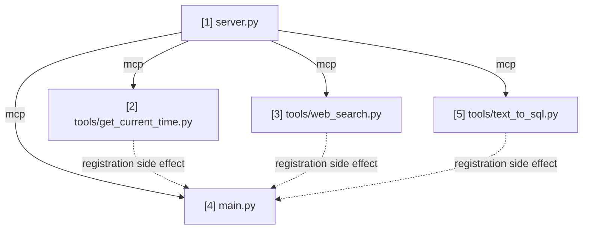

# mcp-tools — Notes & Timeline

Short, plain notes on every file created, in the order it was created, plus two
graphs so the project's history and structure are visible at a glance.

## Timeline

```
[1] .gitignore
     |
     v
[2] README.md
     |
     v
[3] requirements.txt
     |
     v
[4] server.py
     |
     v
[5] tools/get_current_time.py
     |
     v
[6] .env.example
     |
     v
[7] tools/web_search.py
     |
     v
[8] main.py
     |
     v
[9] rag-text-to-sql/pyproject.toml
     |
     v
[10] tools/text_to_sql.py   <-- latest; no further lesson currently planned
```

## Routes Graph (import / dependency connections)

This is ONE single graph covering the whole project — never split into
multiple smaller diagrams scattered through this file. It is different from
the Timeline above: the Timeline shows every file with real content in
creation order, while the Routes Graph only shows files that actually contain
import-relevant logic — skip `.gitignore`, `.env`/config files, READMEs,
dependency manifests, and any `__init__.py` package-marker file.
Every arrow means "the file at the tail is imported by the file at the head,"
labeled with *what* it imports.

**The number in each node's label is its own sequence number within THIS
graph only — it does NOT match the Timeline number for the same file.**

`server.py` is Routes Graph node 1 (Timeline `[4]`). `tools/get_current_time.py`
is Routes Graph node 2 (Timeline `[5]`) — it imports the shared `mcp` instance
from `server.py` to register itself via `@mcp.tool()`. `tools/web_search.py`
is Routes Graph node 3 (Timeline `[7]`) — same import, for the same reason.
`main.py` is Routes Graph node 4 (Timeline `[8]`) — it imports `mcp` from
`server.py` (to call `mcp.run(...)`) and imports all three tool modules
(purely to trigger their registration side effect). `tools/text_to_sql.py`
is Routes Graph node 5 (Timeline `[10]`) — imports `mcp` from `server.py`
like the other two tools, plus `run_query`/`run_query_no_cache` from the
externally-installed `rag-text-to-sql` package (not itself a node in this
graph — it's a separate project's own codebase, not a file of this one,
same reasoning as why `mcp`/`httpx`/`ddgs` aren't nodes here either).



## File notes

No analogies here — plain, factual logic and motive only (analogies belong in
chat and in CLAUDE.md, not here).

### [1] .gitignore
- Motive: Standard Python ignore rules so venv, caches, and secrets never get
  committed; also excludes `reference-tools-repo/`, a local clone of the
  companion repo kept for reference only, not part of this project's history.
- Logic: Excludes `__pycache__/`, `.venv/`, `.env*` (except `.env.example`/
  `.env.sample`), test/lint caches, IDE/OS files, and `reference-tools-repo/`.

### [2] README.md
- Motive: Minimal starter documentation for a brand-new, empty project — states
  what the project will be and its current status honestly (no runnable code
  yet) rather than describing unbuilt features as if they exist.
- Logic: Title, one-paragraph description linking to the companion repo,
  status note, placeholder Getting Started, TODO license.

### [3] requirements.txt
- Motive: Dependency manifest, created empty since no code exists yet —
  packages get added alongside the file that first needs them, not
  pre-populated speculatively.
- Logic: Was header-comment-only; now pinned via `pip freeze` after installing
  `mcp` alongside `server.py` (file [4]).

### [4] server.py
- Motive: A single shared place for the MCP server instance, the same role
  `tools/registry.py` played in the companion repo. Kept separate from
  `main.py` to avoid a circular import: `main.py` will need to import tool
  files for their registration side effect, and tool files need to import
  this instance — if both lived in `main.py`, that would be circular.
- Logic: Imports `FastMCP` from the official MCP Python SDK and instantiates
  one server, `mcp = FastMCP("tools")`. No tools registered, no run/launch
  code — the instance is inert until a tool file decorates a function on it
  and `main.py` calls `mcp.run(...)`.

### [5] tools/get_current_time.py
- Motive: First real tool, ported from the companion repo. Chosen first there
  (and here) because it needs no external API or paid provider — simplest
  possible case to prove the registration mechanism works before adding one
  with network calls.
- Logic: Imports `mcp` from `server.py`. `get_current_time(timezone: str =
  "UTC") -> str` is decorated with `@mcp.tool()`, which registers it and
  auto-generates its JSON Schema from the type hints (optional string
  parameter, since it has a default) and the docstring (summary becomes the
  tool description, the `Args:` line becomes the parameter description) —
  unlike the companion repo, no schema dict is hand-written. Body unchanged:
  looks up the IANA timezone via `zoneinfo.ZoneInfo`, raises `ValueError` on
  an unknown zone name, formats the current time with `strftime`.

### [6] .env.example
- Motive: Placeholder env var names for the Tavily API key, so a real key is
  never committed. Same secret-hygiene rule as the companion repo.
- Logic: One variable, `TAVILY_API_KEY`, with a placeholder value and a note
  that the default `duckduckgo` provider needs no key.

### [7] tools/web_search.py
- Motive: Second tool, ported from the companion repo — the one with real
  external calls (DuckDuckGo via `ddgs`, Tavily via `httpx`), and the one
  that introduces `Literal`-typed parameters as FastMCP's equivalent of a
  hand-written JSON Schema enum.
- Logic: Imports `mcp` from `server.py`. Three unchanged helpers
  (`_search_tavily`, `_search_duckduckgo_sync`, `_search_duckduckgo`) do the
  actual HTTP/library calls. `web_search(query: str, provider:
  Literal["duckduckgo", "tavily"] = "duckduckgo")` is decorated with
  `@mcp.tool()`; the `Literal` type generates an enum-constrained schema, so
  pydantic rejects an invalid `provider` via validation before the function
  body runs — the companion repo's final `raise ValueError(f"Unknown search
  provider: {provider}")` fallback is therefore unreachable and was removed.
  Docstring carries the same cost-aware guidance (prefer the free
  `duckduckgo` provider, use `tavily` only when needed) as the companion
  repo's standing rule required.

### [8] main.py
- Motive: The actual entry point — every earlier file is inert until
  something imports the tool modules (triggering their `@mcp.tool()`
  registration) and starts the transport loop. Successor to the companion
  repo's `main.py` (FastAPI app-building) and `agent.py` (execution) combined
  into one much smaller file, since `mcp.run(...)` replaces both the
  app-building and the manual `uvicorn.run(...)` call.
- Logic: Imports `tools.get_current_time` and `tools.web_search` purely for
  their import-time registration side effect (unused otherwise, same
  `# noqa: F401` pattern as the companion repo). Imports `mcp` from
  `server.py`. Inside `if __name__ == "__main__":`, reads `HOST`/`PORT` from
  the environment (defaults `0.0.0.0`/`8100`). Originally called the
  convenience `mcp.run(transport="streamable-http", host=host, port=port)`;
  revised to build the Starlette app explicitly via
  `mcp.streamable_http_app()`, attach `CORSMiddleware` via
  `app.add_middleware(...)`, and run it with `uvicorn.run(app, host=,
  port=)`. `allow_origins` reads from a new `CORS_ALLOWED_ORIGINS` env var
  (comma-separated, defaults to `http://localhost:8080`) rather than a
  wildcard, so only the actual Open WebUI origin is trusted — swap this env
  var for the real deployed domain later, never leave it as `*`. Verified
  live: CORS preflight from the allowed origin gets
  `access-control-allow-origin` echoed back; a different origin gets no such
  header and a 400.
  Revised again: testing from a separate machine (a Multipass VM, hitting
  the VM's IP from the host) surfaced `421 Misdirected Request / Invalid
  Host header`. Cause: MCP's DNS-rebinding `Host` header check
  (`TransportSecurityMiddleware`) — `mcp.run()` auto-disables this for
  backward compatibility, but `mcp.streamable_http_app()` does not. Fixed
  by importing `TransportSecuritySettings` from
  `mcp.server.transport_security` and passing
  `mcp.streamable_http_app(transport_security=TransportSecuritySettings(enable_dns_rebinding_protection=False))`.
  A deliberate tradeoff (disables a real protection, acceptable only for
  this local/demo server) — see `CLAUDE.md` Known gaps. Verified: a
  request with a foreign `Host` header went from `421` to the normal `400`
  after this change.
  Revised again: added optional `TLS_CERT_FILE`/`TLS_KEY_FILE` env vars,
  passed to `uvicorn.run(..., ssl_certfile=, ssl_keyfile=)` — needed to
  connect this server to a NemoClaw sandbox (`nemoclaw mcp add` requires
  `https://`). Both unset (the default) keeps serving plain HTTP,
  unaffected. See `CLAUDE.md`'s "Connecting this server to a NemoClaw
  sandbox" section for the self-signed cert generation and the
  `web_search` → `custom_web_search` rename this same effort surfaced.

### [9] rag-text-to-sql/pyproject.toml
- Motive: `rag-text-to-sql` (a separate repo, cloned as a sibling
  directory to consume its `run_query`/`run_query_no_cache` for the new
  `text_to_sql` tool) has no packaging metadata of its own — just a plain
  `app/` directory run via `uvicorn app.main:app`. Without this file,
  importing its code from this project would require a `sys.path` hack;
  with it, it becomes a real installable dependency
  (`pip install -e ./rag-text-to-sql`).
- Logic: `[project]` table (name/version/`requires-python`) plus an
  explicit `dependencies` list scoped to only what `run_query*`'s actual
  call path needs (`langgraph`, `langchain-aws`, `langchain-huggingface`,
  `sqlalchemy`, `psycopg[binary]`, `redis`, `python-dotenv` — not
  `fastapi`/`uvicorn`/`langsmith`, confirmed unused on that path by
  reading real imports). `[tool.setuptools] packages = [...]` explicitly
  lists `app` + its four subpackages + `data`/`data.companies` (the
  latter needed because `nodes.py` imports `data.companies.futwork`) —
  required because setuptools' auto-discovery found multiple top-level
  `__init__.py`-marked folders in that repo (`app`, `data`, `evals`,
  `scripts`) and refused to guess which to package.

### [10] tools/text_to_sql.py
- Motive: Third tool — answers natural-language financial questions by
  generating and executing real SQL, wrapping `rag-text-to-sql`'s
  LangGraph pipeline instead of reimplementing it. First tool in this
  project that depends on real external infrastructure (Bedrock, Neon)
  rather than nothing or one optional key.
- Logic: Imports `mcp` from `server.py` and `run_query` (current name —
  see below) from the editable `rag-text-to-sql` dependency.
  `text_to_sql(question: str) -> str` is decorated with `@mcp.tool()`;
  since the underlying function is synchronous and blocking (real LLM +
  DB calls), the call is wrapped in `asyncio.to_thread(...)`, same
  pattern as `web_search`'s DuckDuckGo wrapper. Raises `ValueError` on any
  of the three domain-specific error fields the pipeline returns
  (`company_detection_error`/`validation_error`/`execution_error`); any
  other exception propagates unwrapped. **Revised, per explicit user
  request**: originally also exposed a Redis-cached `run_query` path
  behind a `use_cache: bool = True` parameter (mirroring `web_search`'s
  cost-aware `provider` pattern); removed entirely, always uncached, since
  Redis wasn't wanted as a requirement. **Revised again, upstream change**:
  the user then removed Redis/caching from `rag-text-to-sql` itself (its
  `tool` branch, pulled via `git pull` into the editable clone) — that
  collapsed the two functions back into one plain `run_query(question)`,
  so `run_query_no_cache` no longer exists at all. Import/call updated
  accordingly (`from app.services.query_service import run_query`); this
  is the kind of breakage an editable install doesn't protect against —
  pulling new upstream code can silently rename/remove what we import, no
  install-time check catches it. Verified live end-to-end, both before and after that
  removal: "what was Futwork's total revenue in March 2026?" correctly
  returned "INR 22,063,632" (matching the other project's own eval
  history) via full pipeline (~10s); after removing caching, re-verified
  with a fresh question ("...in April 2026?" → "INR 21,835,812") with the
  `rag-redis` Docker container stopped entirely, confirming Redis is
  genuinely not required any more; after the upstream `run_query`
  rename, re-verified once more with yet another fresh question
  ("...in May 2026?" → "INR 22,198,754").
